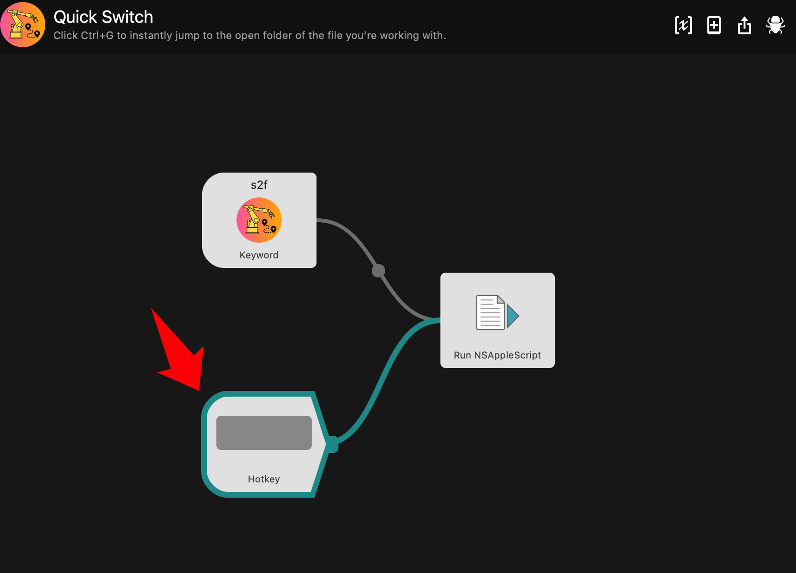

<!-- PROJECT LOGO -->
 

  

  <h2 align="center">Quick Switch</h3>

  

 Click Ctrl+G to instantly jump to the open folder of the file you’re working with.
     
    <a href="http://www.packal.org/workflow/quick-switch"><strong>⏬ Download »</strong></a>
     
  

***
The official repo of the 
[Quick Switch](https://www.bilibili.com/video/BV1gY411A7o6/).
It can help MacOS users easily jump to the open folder of the file you’re working with.
Now, it works in two ways：

1. Type keyword `s2f`

2. Use shortcut `ctrl + g`

<!-- 1. Directly create a folder or any type of empty file.
2. Create folders or files from template files or folders. -->

## Prerequisites
* macOS
* [Alfred Powerpack](https://www.alfredapp.com/)

## Tips
* Set the custom shortcut keys here:

* Follow [真不瓤来](https://space.bilibili.com/184678848) in Bilibili for more interesting tools.

